[comment]: # (controls: true)
[comment]: # (keyboard: true)
[comment]: # (markdown: { smartypants: true })
[comment]: # (hash: false)
[comment]: # (respondToHashChanges: false)


The Postgres Wire Protocol<br />
<small><em>a Muppet AI drama</em></small><br />


<hr style="border-width:1px 0 0 0;" />

<div style="font-size:26px; line-height:56px;"><strong>Tom Reitz</strong> / Data Engineering @ </div>


[comment]: # (!!! data-auto-animate)

What <u><em>is</em></u> a database? &nbsp; What does it <u><em>do</em></u>?<br /><br />
```sql
SELECT * FROM ... WHERE ...
```

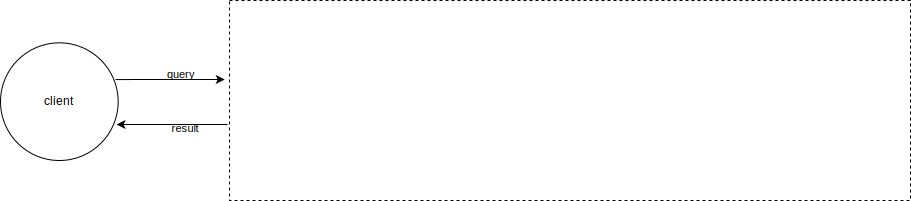

Note:
well it stores data, so it must have some storage...

[comment]: # (||| data-auto-animate)

What <u><em>is</em></u> a database? &nbsp; What does it <u><em>do</em></u>?<br /><br />
```sql
SELECT * FROM ... WHERE ...
```

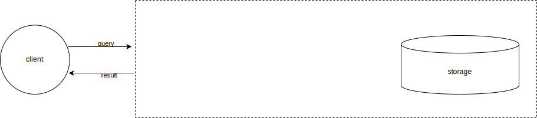

Note:
you have to authenticate first, so it must handle that...

[comment]: # (||| data-auto-animate)

What <u><em>is</em></u> a database? &nbsp; What does it <u><em>do</em></u>?<br /><br />
```sql
SELECT * FROM ... WHERE ...
```

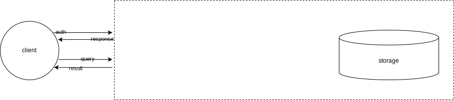

Note:
something **executes** your query...

[comment]: # (||| data-auto-animate)

What <u><em>is</em></u> a database? &nbsp; What does it <u><em>do</em></u>?<br /><br />
```sql
SELECT * FROM ... WHERE ...
```

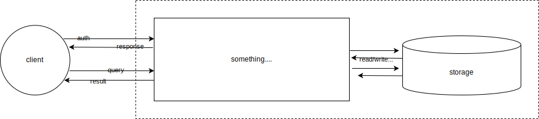

Note:
what exactly? well there are actually a few pieces...

[comment]: # (||| data-auto-animate)

What <u><em>is</em></u> a database? &nbsp; What does it <u><em>do</em></u>?<br /><br />
```sql
SELECT * FROM ... WHERE ...
```

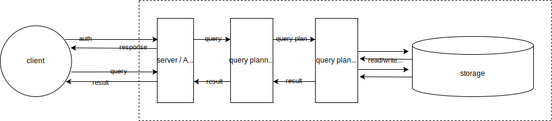

Note:
* First, there's some interface that "listens" for database connections and queries
* Then there's a query planner, which determines an *optimal way* to satisfy the query
* Finally, there's an executor that follows the query plan and reads or writes data to and from storage
Many of these pieces are interesting; we could talk about...

[comment]: # (||| data-auto-animate)

What <u><em>is</em></u> a database? &nbsp; What does it <u><em>do</em></u>?<br /><br />
```sql
SELECT * FROM ... WHERE ...
```

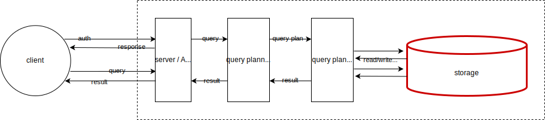

Note:
how the data is stored; row-oriented vs. columnar, sharding, caching, indexing, and more

or we could talk about...

[comment]: # (||| data-auto-animate)

What <u><em>is</em></u> a database? &nbsp; What does it <u><em>do</em></u>?<br /><br />
```sql
SELECT * FROM ... WHERE ...
```

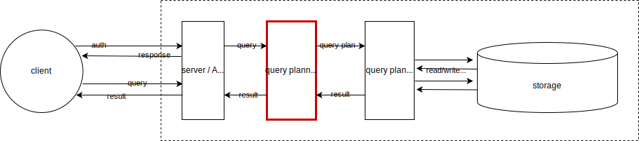

Note:
how the query plan is developed; relational algebra, pushing down projections, using indexes...

but instead, let's talk about...

[comment]: # (||| data-auto-animate)

What <u><em>is</em></u> a database? &nbsp; What does it <u><em>do</em></u>?<br /><br />
```sql
SELECT * FROM ... WHERE ...
```

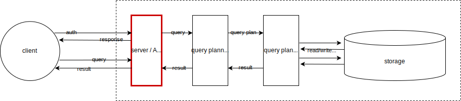

Note:
the interface, and specifically...

[comment]: # (||| data-auto-animate)

What <u><em>is</em></u> a database? &nbsp; What does it <u><em>do</em></u>?<br /><br />
```sql
SELECT * FROM ... WHERE ...
```

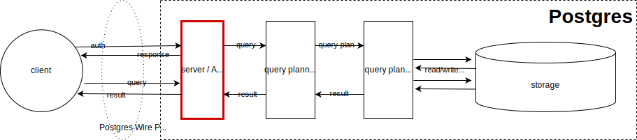

Note:
the interface on Postgres. And...

[comment]: # (||| data-auto-animate)

What <u><em>is</em></u> a database? &nbsp; What does it <u><em>do</em></u>?<br /><br />
```sql
SELECT * FROM ... WHERE ...
```

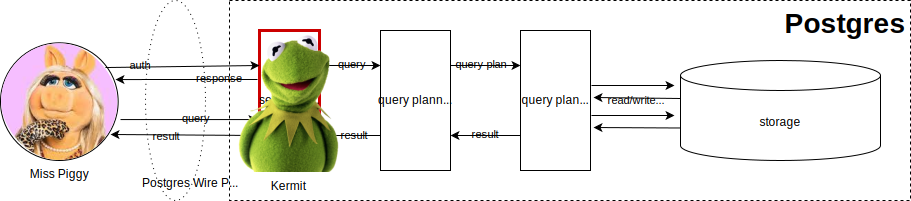

Note:
we'll have some muppets help us! But first:


[comment]: # (!!! data-auto-animate)

What is <u><em>Postgres</em></u>?

[comment]: # (||| data-auto-animate)

What is <u><em>Postgres</em></u>?

* open-source relational database engine


Note:
...

[comment]: # (||| data-auto-animate)

What is <u><em>Postgres</em></u>?

* popular!


Note:
* most popular relational database software with developers (according to [the 2023 Stack Overflow developer survey](https://survey.stackoverflow.co/2023/#most-popular-technologies-database-prof))
* connectors/client libraries exist for all major programming lanuages, many data platforms and tools (ODBC, JDBC, R, Python, Node, DBeaver, ...)

[comment]: # (||| data-auto-animate)

What is <u><em>Postgres</em></u>?

* robust


Note:
* been around for almost four decades, since 1986
* secure, performant, and available in all major cloud platforms


[comment]: # (!!! data-auto-animate)

What is the <u><em>Postgres Wire Protocol</em></u>?

A message-based protocol over TCP/IP for <!-- .element: class="fragment" data-fragment-index="2" -->
* authenticating <!-- .element: class="fragment" data-fragment-index="3" -->
* sending queries <!-- .element: class="fragment" data-fragment-index="4" -->
* receiving results <!-- .element: class="fragment" data-fragment-index="5" -->

with a Postgres server. <!-- .element: class="fragment" data-fragment-index="6" -->

Note:
* it's pretty simple, actually!

[comment]: # (||| data-auto-animate)


Note:
* let's explore it as a typical Muppet conversation.. via text!

[comment]: # (!!! data-auto-animate)


[comment]: # (||| data-auto-animate)


<audio data-autoplay src="media/audio/misspiggy-heya.mp3"></audio>

[comment]: # (||| data-auto-animate)

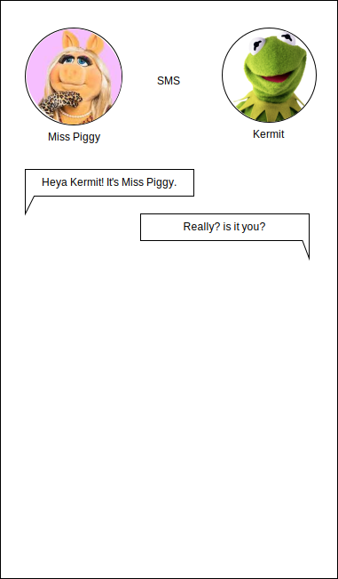

<audio data-autoplay src="media/audio/kermit-really.mp3"></audio>

[comment]: # (||| data-auto-animate)

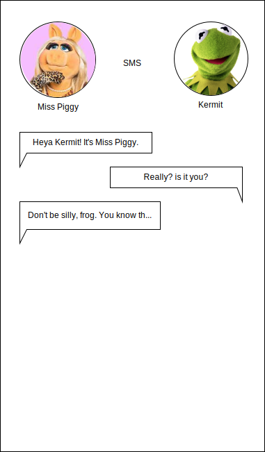

<audio data-autoplay src="media/audio/misspiggy-silly-frog.mp3"></audio>

[comment]: # (||| data-auto-animate)

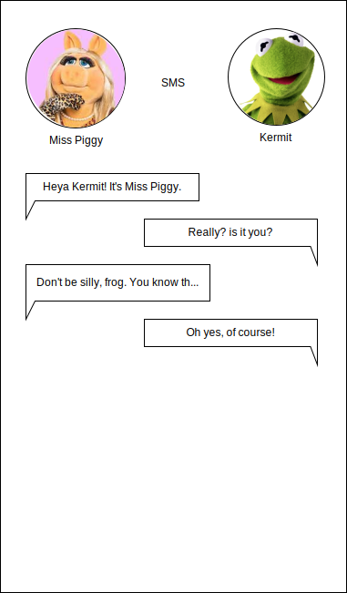

<audio data-autoplay src="media/audio/kermit-yes-of-course.mp3"></audio>

[comment]: # (||| data-auto-animate)

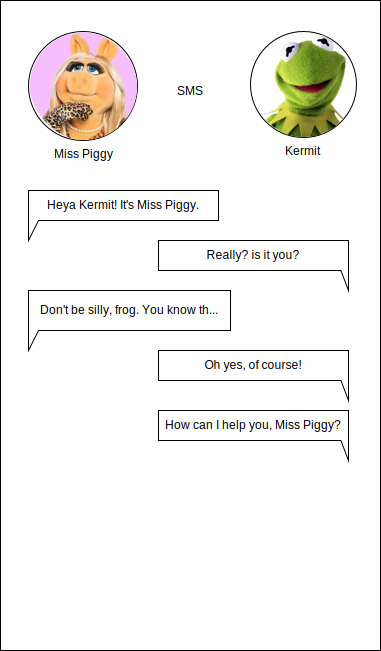

<audio data-autoplay src="media/audio/kermit-how-can-i-help.mp3"></audio>

[comment]: # (||| data-auto-animate)

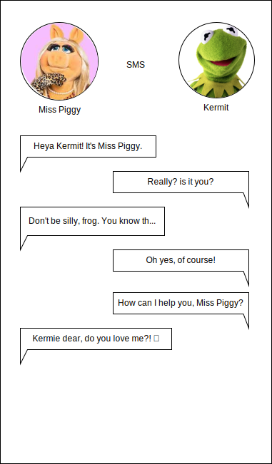

<audio data-autoplay src="media/audio/misspiggy-do-you-love-me.mp3"></audio>

[comment]: # (||| data-auto-animate)


Note:
* come on, I have to build some suspense!

[comment]: # (||| data-auto-animate)

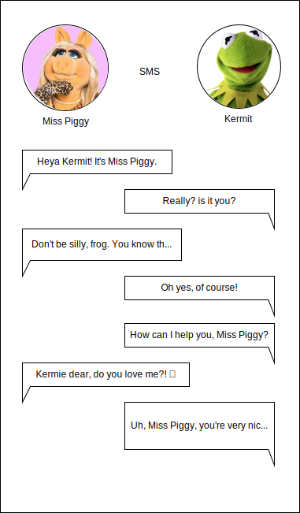

<audio data-autoplay src="media/audio/kermit-no-i-dont.mp3"></audio>

[comment]: # (||| data-auto-animate)

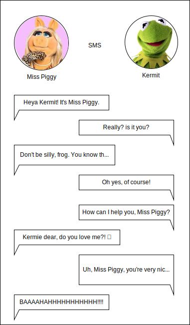

<audio data-autoplay src="media/audio/misspiggy-bahh.mp3"></audio>

[comment]: # (||| data-auto-animate)


[comment]: # (||| data-auto-animate)


Note:
* ok, this is funny, but...

[comment]: # (||| data-auto-animate)


Note:
* each of these messages corresponds to a message type in the Postgres Wire Protocol!

[comment]: # (||| data-auto-animate)

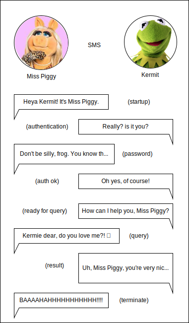

Note:
* let's walk through and see what each message type looks like

[comment]: # (!!! data-auto-animate)

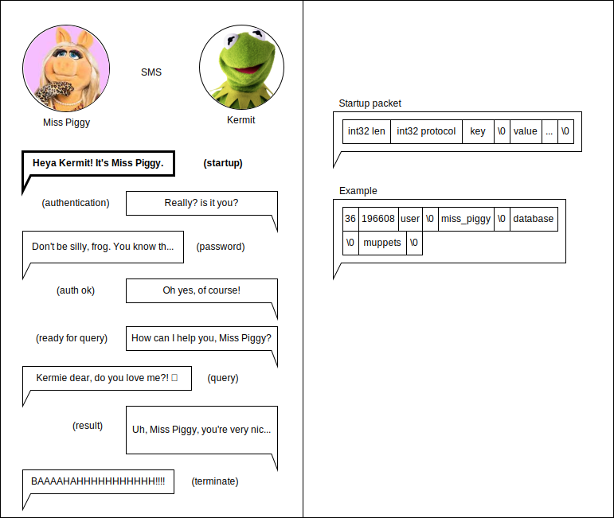

Note:
* startup message has keys and values, null-byte delimited
* all other messages (besides the startup message) follow the same pattern...

[comment]: # (||| data-auto-animate)

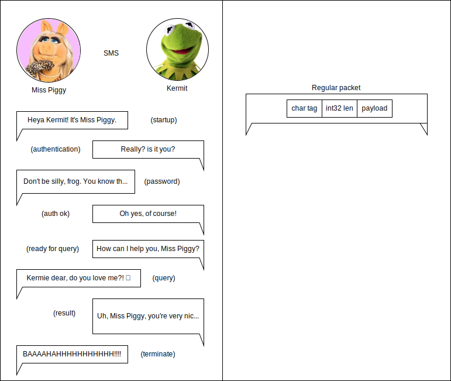

Note:
* a single character indicating the type of message, the length of th 

[comment]: # (||| data-auto-animate)

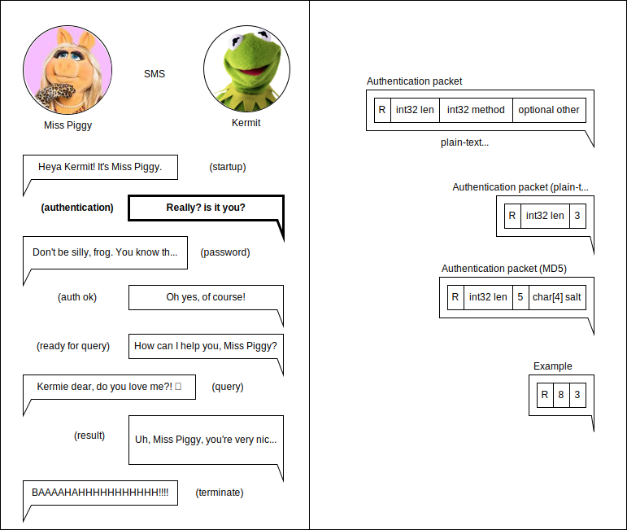

[comment]: # (||| data-auto-animate)

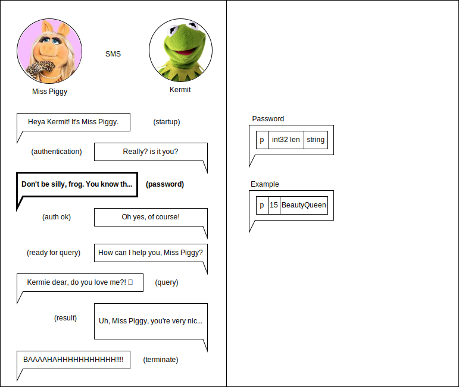

<!-- [comment]: # (||| data-auto-animate)

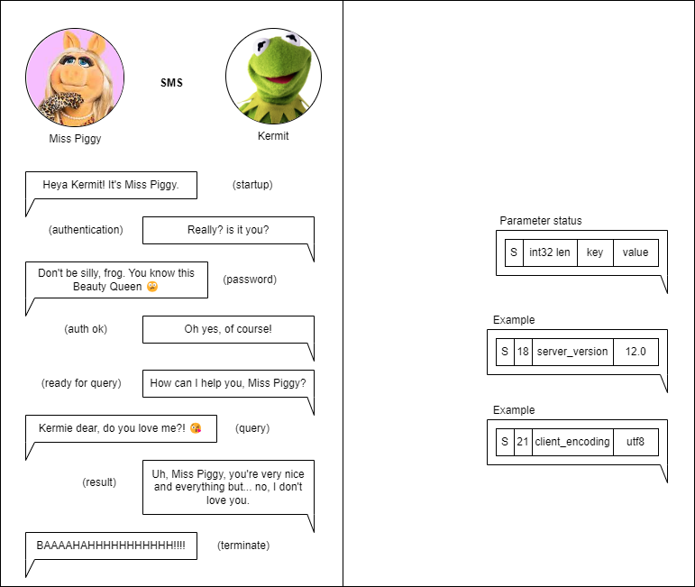 -->

[comment]: # (||| data-auto-animate)

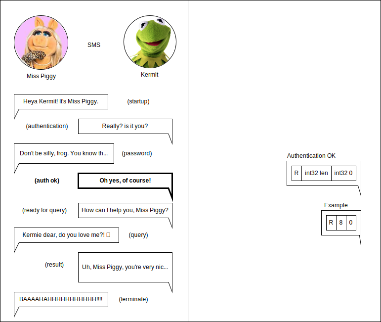

[comment]: # (||| data-auto-animate)

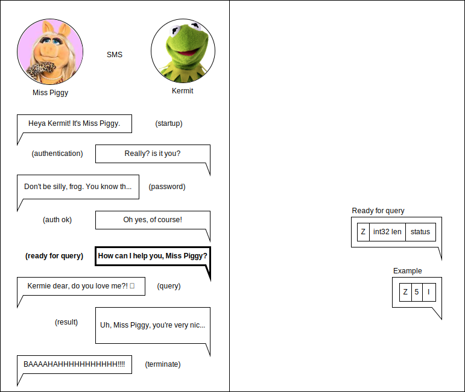

[comment]: # (||| data-auto-animate)

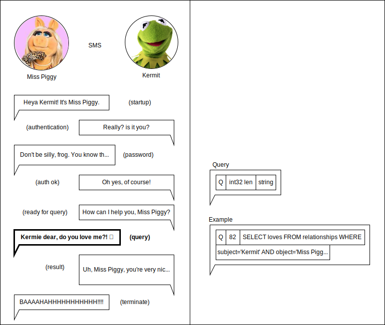

[comment]: # (||| data-auto-animate)

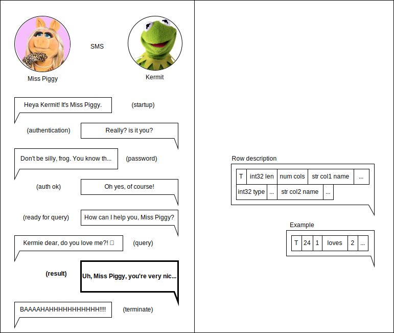

[comment]: # (||| data-auto-animate)

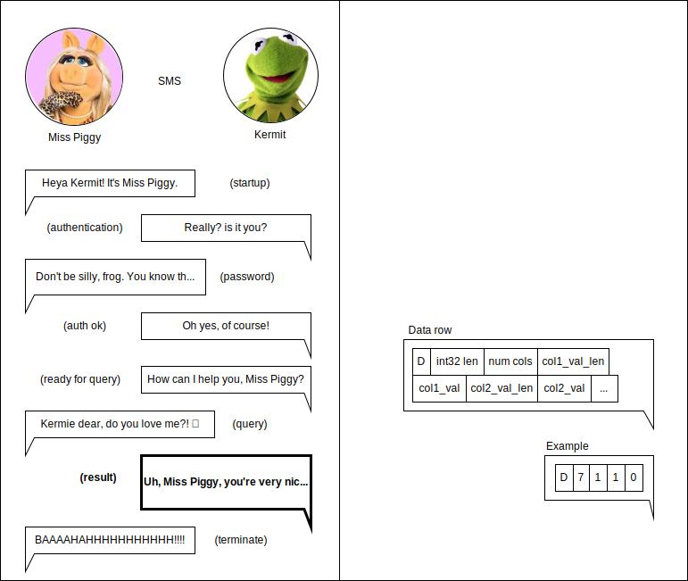

[comment]: # (||| data-auto-animate)

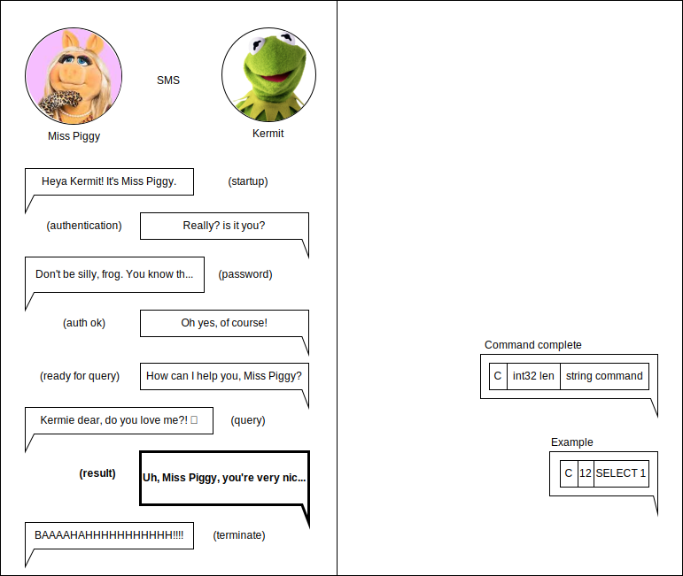

[comment]: # (||| data-auto-animate)

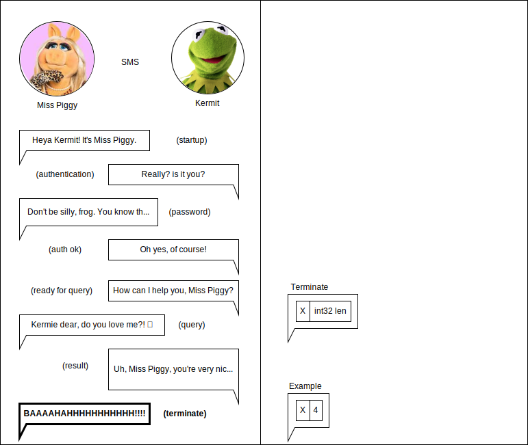

[comment]: # (!!! data-auto-animate)

Implementing the <u><em>Postgres Wire Protocol</em></u> (Node.js)

```javascript
import net from 'net'

let pgServer = (byte) => {
  const server = net.createServer((socket) => {
    socket.on('data', async (data) => {
      if ( data.readInt32BE(4)==196608 && data.length==data.readInt32BE(0) ) {
        // A startup message!
        // The first 4 bytes of the request payload specify the length of the request in bytes
        // The next 4 bytes [0, 3, 0, 0] === 196608 indicate protocol version, 3.0
        // The rest of payload bytes are null-byte delimited key-value pairs that include the username, database, and other client details.

        // Ask for a password:
        socket.write(buffers.authenticationCleartextPassword());

      } else if ( data.toString().startsWith("p") ) {
        // password auth!
        password = data.toString().slice(5,-1)
        console.log(`password was ${password}`);
        // check password... then
        socket.write(buffers.authenticationOk());
        socket.write(buffers.parameterStatus('server_version', '0.0.1'));
        socket.write(buffers.parameterStatus('client_encoding', 'UTF8'));
        socket.write(buffers.parameterStatus('DateStyle', 'ISO'));
        socket.write(buffers.readyForQuery());

      } else if (data.toString().startsWith("Q")) {
        // a query! process it... and send back result `rows`
        socket.write(buffers.rowDescription(rowDescription));
        rows.forEach(row => {
          // ...
          socket.write(buffers.dataRow(rowData));
        });
        socket.write(buffers.commandComplete("done"));
        socket.write(buffers.readyForQuery());
        
      } else if (data.toString().startsWith("X")) ; // do nothing (client is closing the connection)
    });
  });
  server.listen(options.port, options.host);
  return options.port;
}
```
<!-- .element: style="width:120%; margin-left:-10%; font-size:50%" -->

[comment]: # (!!! data-auto-animate)

Cool... but <u><em>why</em></u>?

Note:
* Let's rejoin the muppets...

[comment]: # (!!! data-auto-animate)


Note:
* Kermit is getting tired of Miss Piggy, so he has an idea
* He sets up an AI system to reply to Miss Piggy's texts

[comment]: # (||| data-auto-animate)

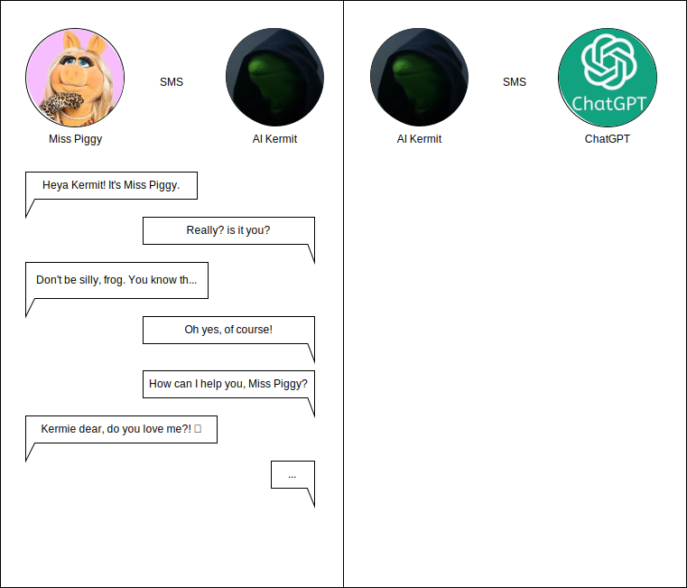

[comment]: # (||| data-auto-animate)

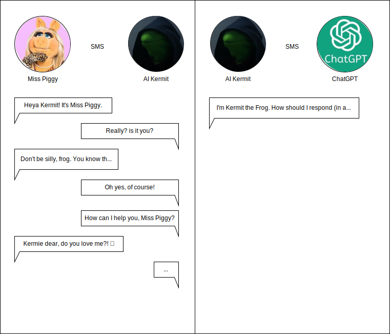

[comment]: # (||| data-auto-animate)

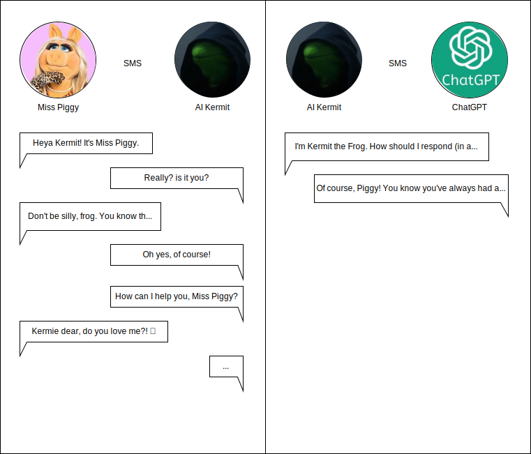

[comment]: # (||| data-auto-animate)


[comment]: # (||| data-auto-animate)

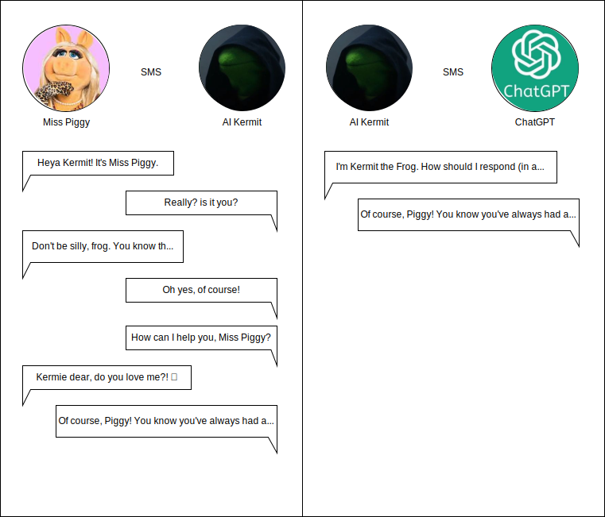

<audio data-autoplay src="media/audio/kermit-special-place.mp3"></audio>

[comment]: # (||| data-auto-animate)

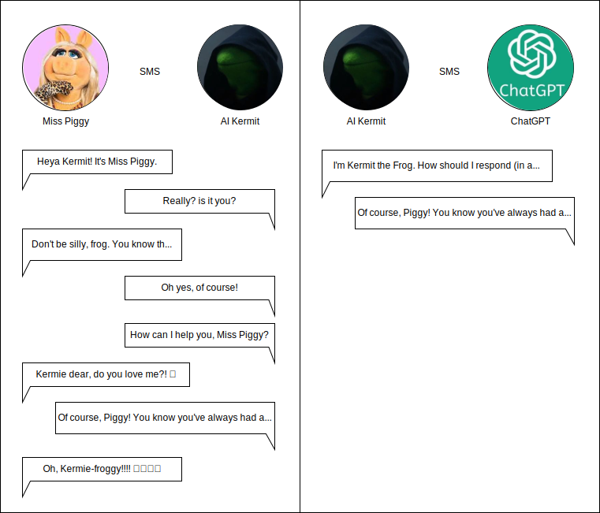

<audio data-autoplay src="media/audio/misspiggy-oh-kermie.mp3"></audio>

[comment]: # (||| data-auto-animate)


[comment]: # (||| data-auto-animate)


[comment]: # (!!! data-auto-animate)

Implementing the Postgres Wire Protocol allows us to
* Intercept queries  <!-- .element: class="fragment" data-fragment-index="2" -->
* Rewrite queries  <!-- .element: class="fragment" data-fragment-index="3" -->
* Cache or modify results  <!-- .element: class="fragment" data-fragment-index="4" -->

Note:
* This is what cube.js does!
* and also bifrost (a tool I've been developing)

[comment]: # (!!! data-auto-animate)

<div style="text-align:left">
🔳 Look up security context about a user<br />
</div>

Note:
Heimdall! an API which, given an email address, tells you what a user's security context - what data they are allowed to see

[comment]: # (||| data-auto-animate)

<div style="text-align:left">
✅ Look up security context about a user (Heimdall)<br />
🔳 Modify their query based on security context<br />
</div>

```sql
SELECT COUNT(*) FROM dim_student
```
becomes
```sql
SELECT COUNT(*) FROM dim_student
WHERE tenant_code='{{security_context.tenant_code}}'
```
becomes
```sql
SELECT COUNT(*) FROM dim_student
WHERE tenant_code='my_district'
```

[comment]: # (||| data-auto-animate)

<div style="text-align:left">
✅ Look up security context about a user (Heimdall)<br />
✅ Modify their query based on security context<br />
🔳 Provide a metrics layer<br />
</div>

```sql
SELECT k_school, SUM(
  CASE WHEN
    exit_withdraw_date>=CURRENT_DATE()
    or exit_withdraw_date IS NULL
  THEN 1 ELSE 0 END
) as num_enrolled
FROM fct_student_school_association
GROUP BY k_school
```
becomes
```sql
SELECT k_school, {{metric_enroll_count()}} as num_enrolled
FROM fct_student_school_association GROUP BY k_school
```

[comment]: # (||| data-auto-animate)

<div style="text-align:left">
✅ Look up security context about a user (Heimdall)<br />
✅ Modify their query based on security context<br />
✅ Provide a metrics layer<br />
🔳 Caching<br />
</div>

Note:
* Hash the (re-written) query, cache for some TTL.

[comment]: # (||| data-auto-animate)

<div style="text-align:left">
✅ Look up security context about a user (Heimdall)<br />
✅ Modify their query based on security context<br />
✅ Provide a metrics layer<br />
✅ Caching<br />
🔳 Pre-aggregation<br />
</div>

Note:
* Define queries and parameters that get run and cached on a schedule

[comment]: # (||| data-auto-animate)

<div style="text-align:left">
✅ Look up security context about a user (Heimdall)<br />
✅ Modify their query based on security context<br />
✅ Provide a metrics layer<br />
✅ Caching<br />
✅ Pre-aggregation<br />
</div>

[comment]: # (!!! data-auto-animate)

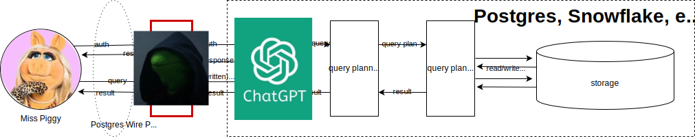

[comment]: # (||| data-auto-animate)

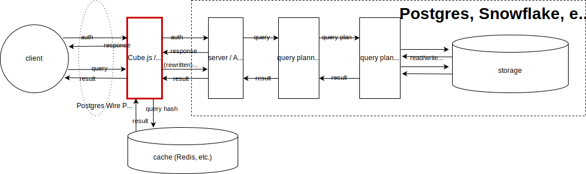

[comment]: # (!!! data-auto-animate)

### Resources

* More about the Postres Wire Protocol [message formats](https://www.postgresql.org/docs/current/protocol-message-formats.html) and a [2014 Wire Protocol PGCon talk](https://www.youtube.com/watch?v=qa22SouCr5E)
* More about [Cube.js](https://cube.dev/docs/product/introduction) and [bifrost](https://github.com/edanalytics/bifrost)
* AI voice generators for [Miss Piggy](https://www.101soundboards.com/boards/111663-miss-piggy-sesame-street-tts-computer-ai-voice) and [Kermit](https://www.101soundboards.com/boards/77305-kermit-the-frog-jim-henson-tts-computer-ai-voice)


[comment]: # (!!! data-auto-animate)

### Thank you! Questions?

<br />
(these slides)
